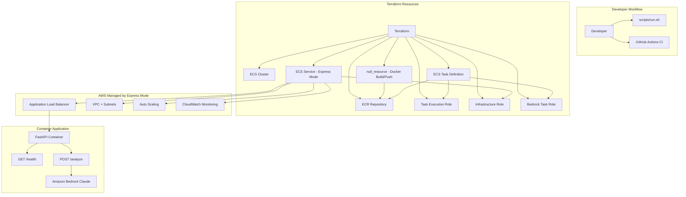

# Design Document

## Overview

This design describes a Terraform demo project that deploys an AI-powered image analysis API using AWS ECS Express Mode and Amazon Bedrock. The project follows a flat Terraform file structure with per-resource IAM roles, automated container image building, and a Python FastAPI application that wraps Bedrock Claude for image analysis.

The architecture demonstrates ECS Express Mode's ability to simplify container deployment by automatically provisioning networking (VPC, subnets), load balancing (ALB with HTTPS), auto scaling, and monitoring from minimal configuration inputs: a container image URI, a task execution role, and an infrastructure role.

### Key Design Decisions

1. **Flat Terraform structure**: All `.tf` files reside at the repository root for simplicity and discoverability in a demo context. No modules are used.
2. **Per-resource IAM roles**: Three separate IAM roles (task execution, infrastructure, bedrock task) follow least-privilege principles with scoped trust policies.
3. **null_resource for Docker build**: Uses `null_resource` with `local-exec` to build and push images, triggered by a content hash of the application source directory.
4. **FastAPI for the container app**: Lightweight Python framework well-suited for REST APIs with built-in request validation (Pydantic) and OpenAPI documentation.
5. **ECS Express Mode**: Reduces Terraform configuration complexity by letting AWS manage ALB, networking, and auto scaling automatically.

## Architecture



### Deployment Flow

1. `terraform init` initializes the working directory
2. `terraform apply` creates ECR repo, builds/pushes Docker image, creates IAM roles, ECS cluster, task definition, and ECS Express Mode service
3. ECS Express Mode automatically provisions ALB, VPC, subnets, auto scaling, and monitoring
4. The service becomes accessible at a unique HTTPS URL provided by Express Mode

## Components and Interfaces

### Terraform Files (Repository Root)

| File | Purpose |
|------|---------|
| `versions.tf` | Terraform and provider version constraints |
| `providers.tf` | AWS provider configuration with default_tags |
| `variables.tf` | Input variables with validation blocks |
| `data.tf` | Data sources (AWS account ID, region, caller identity) |
| `main.tf` | Random suffix resource and local values |
| `ecs.tf` | ECS cluster, service (Express Mode), and task definition |
| `iam.tf` | Three IAM roles with trust policies and permissions |
| `ecr.tf` | ECR repository, lifecycle policy, and Docker build/push resource |
| `outputs.tf` | Output values (service URL, cluster name, service name, ECR URL) |

### Container Application (`app/`)

| File | Purpose |
|------|---------|
| `app/main.py` | FastAPI application with `/analyze` and `/health` endpoints |
| `app/Dockerfile` | Multi-stage or single-stage build with non-root user |
| `app/requirements.txt` | Python runtime dependencies (fastapi, uvicorn, boto3) |

### CI Workflows (`.github/workflows/`)

| File | Purpose |
|------|---------|
| `commitmsg-conform.yml` | Commit message convention enforcement |
| `markdown-lint.yml` | Markdown linting on push and PR |
| `terraform-lint-validate.yml` | Terraform fmt check and validate on push and PR |

### Supporting Files

| File | Purpose |
|------|---------|
| `scripts/run.sh` | Automation script for full lifecycle |
| `.vscode/extensions.json` | Recommended VS Code extensions |
| `.vscode/settings.json` | Editor settings for consistent formatting |
| `.vscode/cspell.json` | Spell check dictionary for project terms |
| `README.md` | Project documentation |
| `LICENSE` | MIT license |

### Container Application Interface

```
POST /analyze
  Request:  { "image_url": "https://example.com/image.jpg" }
  Response: { "image_url": "...", "description": "AI-generated description..." }
  Errors:   422 (invalid/missing URL), 502 (Bedrock failure)

GET /health
  Response: { "status": "healthy" }
```

### Terraform Variable Interface

| Variable | Type | Default | Validation |
|----------|------|---------|------------|
| `project` | string | `"terraform-aws-ecs-express-mode-demo"` | Lowercase alphanumeric + hyphens, 3-32 chars, starts with letter, no trailing hyphen |
| `environment` | string | `"dev"` | Must be one of: "dev", "staging", "prod" |
| `aws_region` | string | `"us-east-1"` | Must match AWS region pattern (e.g., us-east-1, eu-west-2) |

### Terraform Output Interface

| Output | Description |
|--------|-------------|
| `service_url` | ECS Express Mode service HTTPS URL |
| `cluster_name` | ECS cluster name |
| `service_name` | ECS service name |
| `ecr_repository_url` | ECR repository URL for the container image |

## Data Models

### Container Application Request/Response Models

```python
# Request model for POST /analyze
class AnalyzeRequest(BaseModel):
    image_url: HttpUrl  # Pydantic validated URL

# Response model for POST /analyze
class AnalyzeResponse(BaseModel):
    image_url: str
    description: str

# Response model for GET /health
class HealthResponse(BaseModel):
    status: str  # "healthy"

# Error response model
class ErrorResponse(BaseModel):
    error: str  # Human-readable error message
```

### Terraform Resource Naming Convention

All resources use a consistent naming pattern incorporating the project name and a random suffix for uniqueness:

```hcl
locals {
  name_prefix = "${var.project}-${random_string.suffix.result}"
}
```

### IAM Trust Policy Structure

```json
{
  "Version": "2012-10-17",
  "Statement": [
    {
      "Effect": "Allow",
      "Principal": { "Service": "<service-principal>" },
      "Action": "sts:AssumeRole",
      "Condition": {
        "StringEquals": {
          "aws:SourceAccount": "<account-id>"
        }
      }
    }
  ]
}
```

### ECS Task Definition Container Definition

```json
{
  "name": "<container-name>",
  "image": "<ecr-repo-url>:latest",
  "cpu": 256,
  "memory": 512,
  "portMappings": [
    {
      "containerPort": 8000,
      "protocol": "tcp"
    }
  ],
  "logConfiguration": {
    "logDriver": "awslogs",
    "options": {
      "awslogs-group": "/ecs/<name-prefix>",
      "awslogs-region": "<region>",
      "awslogs-stream-prefix": "ecs"
    }
  }
}
```

### ECR Lifecycle Policy

```json
{
  "rules": [
    {
      "rulePriority": 1,
      "description": "Keep last 5 images",
      "selection": {
        "tagStatus": "any",
        "countType": "imageCountMoreThan",
        "countNumber": 5
      },
      "action": {
        "type": "expire"
      }
    }
  ]
}
```


## Correctness Properties

*A property is a characteristic or behavior that should hold true across all valid executions of a system — essentially, a formal statement about what the system should do. Properties serve as the bridge between human-readable specifications and machine-verifiable correctness guarantees.*

### Property 1: Analyze response format invariant

*For any* valid image URL and any non-empty string returned by a mocked Bedrock client, the `/analyze` endpoint SHALL return a JSON response containing both the original `image_url` field (matching the input) and a non-empty `description` field (matching the mocked Bedrock output).

**Validates: Requirements 3.1, 3.3**

### Property 2: Bedrock failure produces 502 error response

*For any* valid image URL and any exception raised by a mocked Bedrock client (including timeout, throttling, service unavailable, and access denied errors), the `/analyze` endpoint SHALL return HTTP status code 502 with a JSON body containing a non-empty `error` field.

**Validates: Requirements 3.6**

### Property 3: Invalid URL rejection produces 422

*For any* string that is not a valid URL (missing scheme, non-HTTP scheme, empty string, whitespace-only, missing host, or malformed structure), the `/analyze` endpoint SHALL return HTTP status code 422 with a JSON body containing a non-empty `error` field, and SHALL NOT invoke the Bedrock client.

**Validates: Requirements 3.7**

### Property 4: Project variable validation accepts valid names and rejects invalid ones

*For any* string of 3-32 characters composed of lowercase letters, digits, and hyphens that starts with a lowercase letter and does not end with a hyphen, the `project` variable validation SHALL accept the value. *For any* string that violates any of these constraints (wrong characters, wrong length, starts with non-letter, ends with hyphen), the validation SHALL reject the value.

**Validates: Requirements 6.1**

### Property 5: AWS region variable validation accepts valid regions and rejects invalid patterns

*For any* string matching the pattern `[a-z]{2}-(north|south|east|west|central)-[0-9]`, the `aws_region` variable validation SHALL accept the value. *For any* string not matching this pattern, the validation SHALL reject the value.

**Validates: Requirements 6.3**

## Error Handling

### Container Application Errors

| Scenario | HTTP Status | Response Body | Behavior |
|----------|-------------|---------------|----------|
| Missing `image_url` field | 422 | `{"error": "image_url field is required"}` | Request rejected before Bedrock invocation |
| Invalid URL format | 422 | `{"error": "Invalid URL format: <details>"}` | Pydantic validation rejects, no Bedrock call |
| Bedrock model timeout | 502 | `{"error": "Bedrock invocation failed: <message>"}` | Timeout exception caught, error returned |
| Bedrock throttling | 502 | `{"error": "Bedrock invocation failed: <message>"}` | Throttling exception caught, error returned |
| Bedrock access denied | 502 | `{"error": "Bedrock invocation failed: <message>"}` | Permission error caught, error returned |
| Bedrock service unavailable | 502 | `{"error": "Bedrock invocation failed: <message>"}` | Service error caught, error returned |

### Terraform Validation Errors

| Variable | Invalid Input Example | Error Message |
|----------|----------------------|---------------|
| `project` | `"My-Project"` | "Project name must contain only lowercase alphanumeric characters and hyphens, start with a letter, not end with a hyphen, and be 3-32 characters. Example: my-demo-project" |
| `environment` | `"production"` | "Environment must be one of: dev, staging, prod. Example: dev" |
| `aws_region` | `"us-east"` | "AWS region must match the pattern like us-east-1, eu-west-2. Example: us-east-1" |

### Automation Script Error Handling

The `scripts/run.sh` script uses `set -e` for immediate exit on failure. Each step is wrapped with a progress message and error context:

```bash
echo "Initializing Terraform..."
if ! terraform init; then
    echo "ERROR: Terraform init failed" >&2
    exit 1
fi
```

### Infrastructure Error Scenarios

| Scenario | Impact | Mitigation |
|----------|--------|------------|
| ECR push fails | No image available for ECS | null_resource fails, terraform apply halts |
| ECS Express Mode provisioning fails | Service not accessible | Terraform reports creation error |
| IAM role creation fails | Dependent resources fail | Terraform dependency graph prevents orphaned resources |
| Health check polling timeout | Script reports failure | Exit with non-zero after 30 retries (5 minutes) |

## Testing Strategy

### Overview

This project uses a **dual testing approach**:
- **Property-based tests** for the container application's input validation, response formatting, and error handling logic
- **Smoke tests** for Terraform configuration structure and static file content verification
- **Integration tests** for end-to-end deployment verification

### Property-Based Testing (Container Application)

**Library:** [Hypothesis](https://hypothesis.readthedocs.io/) (Python PBT library)

**Configuration:**
- Minimum 100 iterations per property test
- Each test references its design document property via tag comment

**Test Implementation:**

| Property | Test Description | Tag |
|----------|-----------------|-----|
| Property 1 | Generate valid URLs + mock Bedrock responses, verify response format | `Feature: ecs-express-mode-demo, Property 1: Analyze response format invariant` |
| Property 2 | Generate valid URLs + various mock exceptions, verify 502 response | `Feature: ecs-express-mode-demo, Property 2: Bedrock failure produces 502 error response` |
| Property 3 | Generate invalid URL strings, verify 422 response and no Bedrock call | `Feature: ecs-express-mode-demo, Property 3: Invalid URL rejection produces 422` |
| Property 4 | Generate strings matching/not matching project name regex, verify validation | `Feature: ecs-express-mode-demo, Property 4: Project variable validation` |
| Property 5 | Generate strings matching/not matching region regex, verify validation | `Feature: ecs-express-mode-demo, Property 5: AWS region variable validation` |

**Generator Strategies:**
- Valid URLs: `hypothesis.strategies.from_regex(r'https://[a-z0-9]+\.[a-z]{2,}/[a-z0-9/]*')`
- Invalid URLs: Mix of empty strings, whitespace, strings without scheme, non-http schemes, missing host
- Bedrock exceptions: Sample from `[ClientError, TimeoutError, ThrottlingException, ServiceUnavailableException]`
- Project names (valid): `hypothesis.strategies.from_regex(r'[a-z][a-z0-9-]{1,30}[a-z0-9]')`
- Region patterns (valid): `hypothesis.strategies.from_regex(r'[a-z]{2}-(north|south|east|west|central)-[0-9]')`

### Unit Tests (Example-Based)

| Test | Validates |
|------|-----------|
| GET /health returns `{"status": "healthy"}` with 200 | Requirement 3.4 |
| POST /analyze with specific valid URL returns expected format | Requirement 3.1, 3.3 |
| Environment variable accepts "dev", "staging", "prod" | Requirement 6.2 |
| Environment variable rejects other values | Requirement 6.2 |

### Smoke Tests (Terraform Structure)

| Test | Validates |
|------|-----------|
| All required .tf files exist at root | Requirement 1.1, 1.2 |
| versions.tf has correct version constraints | Requirement 1.3 |
| providers.tf has default_tags block | Requirement 1.4 |
| iam.tf defines 3 separate IAM roles | Requirement 4.4 |
| Trust policies have condition blocks | Requirement 4.5 |
| outputs.tf has all 4 outputs with descriptions | Requirement 7.1-7.5 |
| CI workflows are in correct directory | Requirement 8.4, 8.5 |
| run.sh has correct shebang and set -e | Requirement 10.1 |
| README.md has required sections | Requirement 11.1-11.6 |

### Integration Tests

| Test | Validates |
|------|-----------|
| `terraform init` succeeds | Requirement 1.3 |
| `terraform validate` passes | Requirements 1-5 (structural correctness) |
| `terraform plan` with valid variables succeeds | Requirement 6 |
| `terraform plan` with invalid variables fails | Requirement 6.5 |
| Full deploy/verify/destroy cycle (manual or CI) | Requirement 2.4, 10 |

### Test File Organization

```
tests/
├── test_app.py              # Property tests and unit tests for container app
├── test_validation.py       # Property tests for variable validation regex
├── conftest.py              # Shared fixtures (mock Bedrock client, test app)
└── test_terraform_structure.py  # Smoke tests for file structure
```
